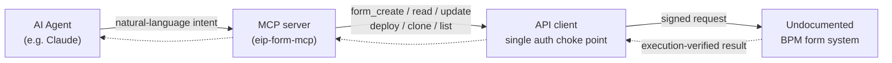
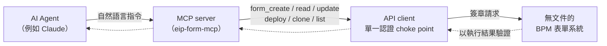

# eip-form-mcp

**Turning an undocumented enterprise BPM form system into an AI-agent-callable MCP toolchain.**

> 🌐 [English](#english) ｜ [繁體中文](#繁體中文)
>
> ⚠️ This repository ships an **illustrative skeleton**, not the production tool. The vendor is unnamed, the authentication is stubbed, and the backend is mocked — on purpose. See [Responsible disclosure](#responsible-disclosure).

---

## English

### TL;DR

I reverse-engineered a company-internal BPM (approval-workflow) form system that had **no official API and no documentation**, and wrapped it into a set of **MCP (Model Context Protocol) tools** so an AI agent can drive it directly — list, read, create, update, deploy, and clone forms, all programmatically.

This is the second case in a single positioning: **using AI agents to reverse-engineer and modernize legacy enterprise systems.** (The first is a 4GL → SQL Server stored-procedure methodology framework.)

### The problem

A typical closed legacy system:

- **No official API, no docs** — every integration had to be figured out from observed client behavior.
- **Building forms by hand is slow and error-prone** — each form means manually laying out a designer, binding fields, and wiring up sub-systems.
- **Completely disconnected from AI agents** — it's a closed web back-office an agent can't touch.

The question I wanted to answer: *can an AI agent drive this closed legacy system directly?*

### Approach: reverse → abstract → agent-ify

1. **Reverse-engineering** — recovered the API structure and authentication mechanism from observed client behavior. *(The mechanism is described; its algorithm is not published — see below.)*
2. **Abstraction** — collapsed scattered API behavior into a small set of **stable, programmable actions**: form create / read / update / deploy / clone, plus the underlying data-source subsystem. The hard part isn't calling it once — it's nailing every action's preconditions, side effects, and irreversible operations so automation doesn't blow up at the edges.
3. **Agent-ification** — exposed those actions as an **MCP toolchain** ([`mcp_server_skeleton.py`](./mcp_server_skeleton.py)) so any MCP-capable agent (e.g. Claude) can build a real, deployable form from a natural-language instruction.

### Architecture



Two ideas carry the design: a **single auth choke point** (every verb is a thin wrapper over one signing function) and **execution-verified results** (a write isn't "done" until its effect is confirmed by running it).

### The 6 core tools

| Tool | What it does |
|------|--------------|
| `form_list`   | List all forms |
| `form_read`   | Read one form's full schema |
| `form_create` | Create a form from a name + field list |
| `form_update` | Update an existing form's fields |
| `form_deploy` | Deploy (publish) a form so it goes live |
| `form_clone`  | Clone an existing form as a template |

The same pattern extends to the data-source subsystem (list / read / create).

### Example: an agent building a form

> **Intent:** *"Clone our standard approval template into a Leave Request form, add a reason and days field, then deploy it."*

The agent turns that one sentence into a tool sequence:

1. `form_clone` — copy the standard template
2. `form_update` — add the leave-specific fields
3. `form_deploy` — make it live

One instruction → a deployed form, with the agent never touching the back-office UI. Run it end-to-end against the mock backend:

```bash
python examples/demo.py
```

### Field notes: reverse-engineering an undocumented system

The transferable part — system specifics abstracted away, engineering judgment kept:

- **Find the one choke point that unlocks the surface.** The system signed every request with a token computed on the client. Once I located and reproduced that, every API verb became a thin wrapper over a single signing function. The highest-leverage move in reverse-engineering is finding the choke point — not grinding every endpoint.
- **Trust execution, not status codes.** A "save" could return `200 OK` and silently do nothing — the value the UI displayed and the value the engine actually ran lived in different places. So I verify every write by executing it and checking the real output. In an undocumented system, the success signal you're handed may be a lie.
- **Capture the protocol; never assume it.** I assumed object IDs could be client-generated. They couldn't — a self-minted ID never routed. The only oracle for an undocumented protocol is captured real traffic, aligned byte-for-byte.
- **Guard the irreversible before automating it.** Some objects could be created but never deleted. So: throwaway test fixtures, a dry-run preview on every write, and a confirmation gate in front of any create — built *before* turning automation loose.
- **A methodology is only real if someone else can reproduce it.** I had a cold-start agent rebuild the integration from my notes alone — twice, forbidden from reading my solution — to prove the *method* was complete, not just the result. (The same player-vs-referee discipline I apply to evals.)

### Why this maps to "AI Agent Engineer"

- **It isn't prompt engineering** — the core is reverse-engineering a closed system and abstracting it into a stable tool interface. That's engineering.
- **MCP is the integration layer of the agent era** — wiring a legacy system to MCP gives an AI agent a hand that operates a real enterprise system.
- **It's transferable** — the methodology (`observe → reverse interface → abstract into stable actions → wrap as agent tools`) isn't tied to this one system. That makes it a *capability*, not a one-off.

### Responsible disclosure

This repo deliberately **omits**:

- the **authentication algorithm** (the system uses a custom client-side scheme I reverse-engineered to call its API; the recipe is not published, because it is a live commercial product other organizations also run);
- the **vendor / product name**;
- all **internal hosts, identifiers, and real data**.

What it keeps: the problem, the methodology, the abstracted tool interface, and a runnable skeleton.

> Knowing *what not to publish* is part of the job. Being able to reverse-engineer a system and being able to talk about it responsibly are two skills that both matter.

### Scope & honesty

- This is an **internal, single-system** automation for a company MIS workflow — not a large product.
- **Not a penetration test** — I'm an authorized administrator automating actions I already had the right to perform, not bypassing access control.
- The authentication details are withheld by choice, not because the content is incomplete.

### Run the skeleton

```bash
printf '%s\n' \
  '{"jsonrpc":"2.0","id":1,"method":"initialize"}' \
  '{"jsonrpc":"2.0","id":2,"method":"tools/list"}' \
  | python mcp_server_skeleton.py
```

The skeleton runs against an in-memory mock backend — no live system required.

---

## 繁體中文

### 一句話

我把一套**沒有官方 API、也沒有文件**的公司內部 BPM（簽核流程）電子表單系統，逆向成一組 **MCP（Model Context Protocol）工具**，讓 AI Agent 能直接驅動它——列出、讀取、建立、修改、部署、複製表單，全程程式化。

這是「**用 AI Agent 逆向 + 現代化 legacy 企業系統**」這條定位的第二個案例（第一個是 4GL → SQL Server SP 的方法論框架）。

### 問題

一個典型的封閉 legacy 系統：

- **無官方 API、無文件**——所有自動化都得從觀察 client 行為自己摸。
- **手工建表單貴又易錯**——每張表單要手點設計器、綁欄位、接子系統。
- **跟 AI Agent 完全脫節**——它是個封閉的 web 後台，Agent 碰不到。

我想回答：**能不能讓 AI Agent 直接驅動這個封閉系統？**

### 做法：逆向 → 抽象 → Agent 化

1. **逆向**——從觀察 client 行為，還原它的 API 結構與認證機制。*（機制有描述，演算法不公開，見下。）*
2. **抽象**——把散落的 API 行為收斂成一組**穩定、可程式化呼叫的動作**：表單建立／讀取／修改／部署／複製，加上底層資料來源子系統。難的不是「呼叫一次」，是摸清每個動作的前置條件、副作用、不可逆操作，自動化才不會在邊界炸掉。
3. **Agent 化**——把這些動作包成 **MCP 工具鏈**（[`mcp_server_skeleton.py`](./mcp_server_skeleton.py)），讓任何支援 MCP 的 Agent 能用一句自然語言指令，落地成一張真的、可上線的表單。

### 架構



兩個想法撐起整個設計：**單一認證 choke point**（每個動作都只是「一支簽章函式」的薄包裝）、**以執行結果驗證**（寫入要等它的效果被執行確認，才算「完成」）。

### 6 個核心工具

| 工具 | 功能 |
|------|------|
| `form_list`   | 列出所有表單 |
| `form_read`   | 讀取單張表單完整 schema |
| `form_create` | 依名稱 + 欄位清單建立表單 |
| `form_update` | 修改既有表單欄位 |
| `form_deploy` | 部署（上線）表單 |
| `form_clone`  | 以既有表單為範本複製 |

同樣的模式可延伸到資料來源子系統（列出／讀取／建立）。

### 範例：Agent 建一張表單

> **指令：**《把我們的標準審批範本複製成一張請假單，加上事由和天數欄位，然後部署。》

Agent 把這一句翻成一串工具呼叫：

1. `form_clone` — 複製標準範本
2. `form_update` — 加請假專屬欄位
3. `form_deploy` — 上線

一句指令 → 一張部署好的表單，Agent 全程沒碰後台 UI。對 mock 後端端到端跑：

```bash
python examples/demo.py
```

### 現場筆記：逆向一個無文件系統

可遷移的部分——系統細節抽掉了，工程判斷留著：

- **找到那個能打開整片介面的 choke point。** 系統每個請求都用 client 端自算的 token 簽章。一旦定位並重現它，每個 API 動作都只是「單一簽章函式」的薄包裝。逆向最高槓桿的一步是找 choke point，不是一個個磨 endpoint。
- **信執行結果，別信狀態碼。** 「儲存」可能回 `200 OK` 卻什麼都沒做——UI 顯示的值和引擎真正執行的值存在不同地方。所以我每次寫入都用執行結果驗證。在無文件系統裡，它給你的成功訊號可能是假的。
- **實捕協定，絕不假設。** 我假設物件 ID 可以 client 端自生，結果不行——自生的 ID 永遠路由不到。無文件協定唯一的 oracle 是逐位元組對齊的真實流量。
- **自動化不可逆操作前先上護欄。** 有些物件能建不能刪。所以：拋棄式測試物件、每次寫入先 dry-run 預覽、任何建立前加確認門——在放手自動化**之前**就建好。
- **方法論能被別人重現才算數。** 我讓一個冷啟 agent 只靠我的筆記重建整個整合——兩次、全程禁讀我的解答——來證明「方法」本身完整，不只是結果。（跟我做 eval 的球員兼裁判紀律同源。）

### 為什麼對準「AI Agent Engineer」

- **不是 prompt 工程**——核心是把封閉系統**逆向 + 抽象成穩定工具介面**，這是工程。
- **MCP 是 Agent 時代的整合層**——把 legacy 系統接上 MCP，等於給 AI Agent 一隻能操作真實企業系統的手。
- **可遷移**——方法論（`觀察 → 逆向介面 → 抽象成穩定動作 → 包成 Agent 工具`）不綁這一個系統，這才是「能力」而非「一次性成果」。

### 負責任揭露

本 repo 刻意**不公開**：

- **認證演算法**（系統用自訂 client 端認證，我逆向出來才能程式化呼叫；因為它是仍在線上、別家也在用的商業產品，演算法不公開）；
- **廠商 / 產品名稱**；
- 所有**內網位址、識別碼、真實資料**。

保留的是：問題、方法論、抽象後的工具介面，以及一支可跑的骨架。

> 知道**哪些不該公開**本身就是這份工作的一部分。能逆向一個系統、跟能負責任地談論它，是兩種都需要的能力。

### 規模與誠實

- 這是一個**內部、單一系統**的自動化，服務公司 MIS 的日常表單流程，不是大型產品。
- **不是滲透測試**——我是有權限的管理者，自動化我本來就有權做的操作，不是繞過權限控管。
- 認證細節是**有意識地保留**，不是內容不完整。

### 跑骨架

```bash
printf '%s\n' \
  '{"jsonrpc":"2.0","id":1,"method":"initialize"}' \
  '{"jsonrpc":"2.0","id":2,"method":"tools/list"}' \
  | python mcp_server_skeleton.py
```

骨架跑在記憶體 mock 後端上，不需要任何 live 系統。

---

## License

[MIT](./LICENSE)
